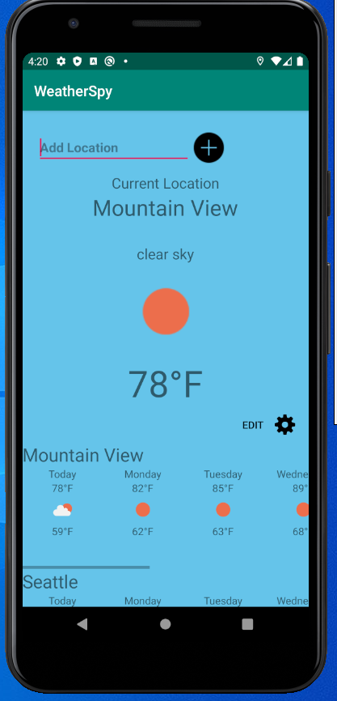

# WeatherSpy

Copyright (c) Victor Ochia This work is available under the "MIT License" Please see the file LICENSE for license terms. 
For any inquires, please Email : vicochias@gmail.com.

# What is WeatherSpy

WeatherSpy is a simple intuitive weather app that displays the weather for your current location. Additionally, a user is able to add and delete forecasts 
for any city that they like as well.

# In Depth

WeatherSpy pulls data from an API on openweathermap.com. The program is designed from a MVC standpoint where only the controller communicates with the model and 
view. It uses LocationManager and LocationListenr to locate current coordinates and feeds this to the API in order to retrieve weather information. Additionally,
when a user enters a city, the API is able to spit out a forecast for each city. The forecast views are created dynamically during runtime. Fragment use is demonstrated
with each forecast. A user may delete a forecast dynamically as well. Everything is saved once a user exits the app and their forecasts can be seen until deleted.

# How is WeatherSpy currently

WeatherSpy is in good shape. Additional features may be added later such as a notification for a users desired weather

# Build instructions

Go to www.androidstudio.com and download the Android Studio IDE. You must have JDK installed as well. After opening a new 
project, clone this repository. Run the application using an emulator (Preferably API 29 for best results). .APK file 
included can be used to attempt to run app on your own Android device.

If any inquires or questions arise, to not hesitate to contact me by email: vicochias@gmail.com

